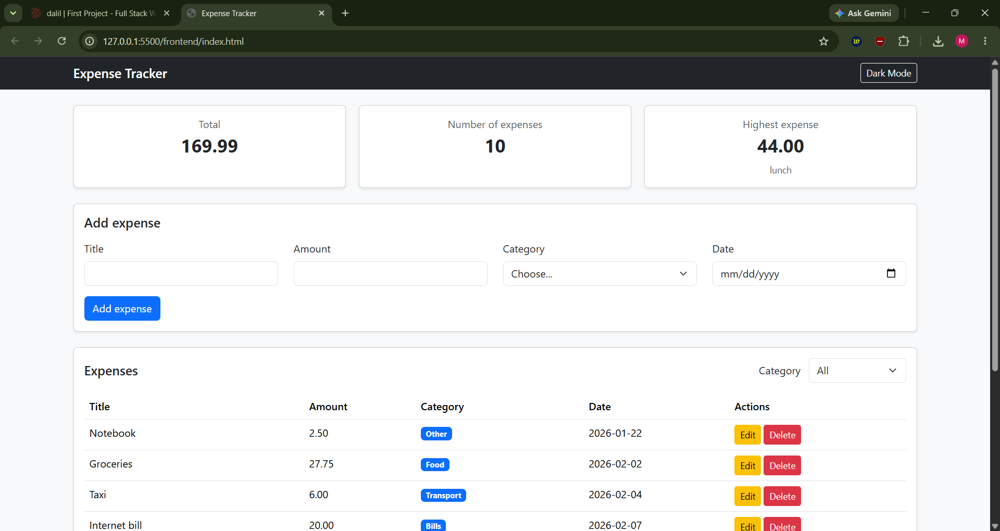
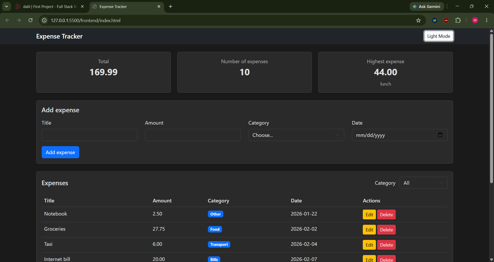

# Expense Tracker

A full-stack web application for tracking personal expenses. Users can add, edit, delete, and filter daily expenses, with live summary cards showing the total amount, the number of expenses, and the highest expense. Data is stored in a PostgreSQL database and served through a Node.js/Express API.

---

GitHup Link:

🔗 **Repository:** https://github.com/MajdOkour/First-APP

## Technologies Used

### Frontend

- HTML5
- CSS3 (with CSS Grid)
- JavaScript (Vanilla)
- Bootstrap 5.3.8

### Backend

- Node.js
- Express
- CORS
- dotenv

### Database

- PostgreSQL
- pg

---

## Project Structure

expense-tracker/
│
├── frontend/
│ ├── index.html
│ ├── css/
│ │ └── style.css
│ └── js/
│ └── app.js
│
├── backend/
│ ├── server.js
│ ├── package.json
│ ├── package-lock.json
│ ├── schema.sql
│ ├── .env.example
│ └── node_modules/ (do not submit)
│
└── README.md

text

---

## How to run

### Backend

1. Open pgAdmin and connect to your PostgreSQL server.
2. Right-click **Databases** → **Create** → **Database**, name it `expense_tracker`, and save.
3. Right-click the new database → **Query Tool**, paste the content of `backend/schema.sql`, and press **F5**.
4. Open a terminal and go to the backend folder:
   ```bash
   cd backend
   Install the dependencies:
   ```

bash
npm install
Copy .env.example to a new file called .env and edit the password:

text
DB_HOST=localhost
DB_PORT=5432
DB_USER=postgres
DB_PASSWORD=your_password_here
DB_NAME=expense_tracker
Start the server:

bash
node server.js
You should see: server started on port 3000

Frontend
In VS Code, open frontend/index.html.

Right-click the file → Open with Live Server.

The page opens at http://127.0.0.1:5500/frontend/index.html.

The backend must stay running while you use the frontend.

API Endpoints
Method Endpoint Description
GET /api/expenses Get all expenses
GET /api/expenses/:id Get one expense
POST /api/expenses Add a new expense
PUT /api/expenses/:id Update an expense
DELETE /api/expenses/:id Delete an expense
Features
☑ Add an expense (with validation)
☑ Delete an expense
☑ Edit an expense
☑ Filter by category
☑ Summary cards (total, count, highest)
☑ Data is saved in a PostgreSQL database
☑ Responsive design (works on mobile)
☑ CSS Grid for summary cards
☑ Dark Mode (with localStorage)

Screenshots

## Screenshots

### Desktop



### Mobile

.png>)

### Dark Mode



What was the hardest part?
The hardest part was that I didn't have a clear picture of how to connect the frontend to the API and the backend. I had to research, learn on my own, and ask friends for help to understand how fetch works, how HTTP requests travel between the browser and the server, and how to handle responses and errors properly. It took time and a lot of trial and error, but eventually the whole flow became clear.

Author
Name: Majd Okour

Course: Full Stack Web Development

Academy: Dalil Training Academy

Date: 2026


